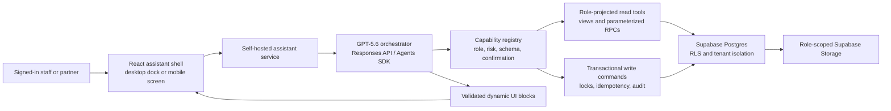

I have an interesting task for you now. I need to build an AI assistant for this Vehicle dealer platform. Recently Redbus has created a super duper AI assistant called Ray. This agent is capable of helping the user with all the functionality he can perform manually in the app. It supports multiple languages. It generates UI content dynamically for the user request. It just not only brings the list, it also explains whats in the extracted result. Chat UI is awesome, language support awesome and its fast it has access to redbus database and application functionality same like the use who is using it. Can you plan to build such a fantastic agent for this platform ? I am using 5.6 Sol Ultra for this planning. Expecting an exceptional plan for this. Also please recommend the model which i need to choose for the implementation. 

Monday 8:52 PM

Worked for 11m 25s

Yes—this can become a genuinely powerful conversational operating layer for Salam Motors, not merely a chatbot.
My headline recommendation:
Build the implementation with GPT-5.6 Sol Ultra. It is the right single Codex choice for the foundational database, authorization, agent tooling, and dynamic UI work.
Establish the production assistant’s quality baseline with gpt-5.6-sol.
After the evaluation suite is stable, test gpt-5.6-terra as the default production model, escalating ambiguous or sensitive workflows to Sol. Reserve Luna for low-risk, high-volume background work.
Use the Responses API and a single orchestrator agent with deterministic tools. Do not begin with a complex multi-agent runtime.
OpenAI’s current guidance identifies Sol as the flagship model, Terra as the lower-cost strong performer, and Luna as the high-volume option. It also recommends starting with the most capable model to establish accuracy before testing smaller alternatives. GPT-5.6 guidance, model-selection guidance.
1. What Salam Motors already has
The repository is unusually well positioned for this product:
React 18, TypeScript, Vite and Tailwind.
Supabase Auth, Postgres, RLS, Storage and Edge Functions.
Five staff roles: owner, manager, sales executive, accountant and mechanic inspector.
A separate read-only investor/partner portal.
Six configured languages: English, Hindi, Tamil, Malayalam, Kannada and Telugu.
Rich operational domains: inventory, onboarding, purchases, expenses, inspections, documents, photos, listings, sales, alerts, compliance, investments, profit distribution, settlements, team management and audit history.
Separate desktop and mobile applications with reusable cards, badges, score rings, forms, sheets and document previews.
The relevant foundations are visible in [App.tsx (line 22)](/home/jahir/code/project-repo/mustlearn/salam-motors/project/src/App.tsx:22), [types.ts (line 1)](/home/jahir/code/project-repo/mustlearn/salam-motors/project/src/lib/types.ts:1), [i18n/index.ts (line 1)](/home/jahir/code/project-repo/mustlearn/salam-motors/project/src/i18n/index.ts:1), and the authoritative [RLS role matrix (line 1)](/home/jahir/code/project-repo/mustlearn/salam-motors/project/supabase/migrations/20260727110000_role_based_rls_cutover.sql:1).
The main constraint is important: the platform is ready for a read-capable assistant, but it is not yet safe for a write-capable assistant.
2. Product north star
The assistant should follow one rule:
It may perform everything the signed-in user is authorized to perform, but it must never receive unrestricted database or application access.

Every useful answer should contain:
A direct answer.
An explanation of what was found and why it matters.
Evidence-backed dynamic UI.
Safe, relevant next actions.
For example:
“Three vehicles older than 45 days are tying up ₹8.4 lakh. Two cannot be listed because their RC or purchase-payment evidence is incomplete. The Honda City has the largest estimated downside.”

Then render:
A metric strip.
Three ranked vehicle cards.
Cost, age, document and compliance indicators.
“Open vehicle”, “Compare”, “Upload missing document” and “Export” actions.
Data timestamp, filters applied and result count.
This delivers the “list plus understanding” behavior you admired.
3. Recommended architecture

Assistant service
Create a small server-side service responsible for:
Verifying the Supabase JWT.
Resolving the user, active organization, role and partner identity.
Holding the OpenAI API key.
Streaming responses.
Filtering available tools by capability.
Validating every tool input and output.
Creating and executing confirmation proposals.
Recording traces, costs, latency and audit events.
A self-hosted ChatKit integration is worth using because it provides a polished chat shell, streaming, attachments, widgets and server-handled actions. Its widgets match the desired dynamic UI closely. For new work, OpenAI currently recommends a custom server-side ChatKit integration rather than Agent Builder. ChatKit architecture, widgets and actions.
Because ChatKit’s current self-hosted server package is Python, the cleanest high-quality option is:
React/TypeScript for the existing application and widget integration.
A small Python/FastAPI assistant service using ChatKit and the Agents SDK.
Supabase transactional RPCs as the business capability layer.
If maintaining a second language is unacceptable, use the TypeScript Agents SDK with a custom React chat renderer. Preserve the same capability and UI schemas either way.
The Responses API should be the underlying agent primitive; OpenAI recommends it for new agentic projects and it supports state, multimodal inputs and tool loops. Responses API guidance.
4. Phase-zero work: make application capabilities agent-safe
These are existing platform issues that should be resolved before enabling AI writes.
Blocker	Current behavior	Required correction
Composite transactions	Vehicle onboarding and sale completion perform several browser-side writes with best-effort rollback	Replace with atomic Postgres commands
Role/workflow mismatch	Sales can start onboarding but cannot write purchase rows; manager/sales can start a sale but cannot complete profit-distribution writes	Decide the business policy and encode it in one server-side capability
Soft-delete bypass	“Delete” changes deleted_at, so roles with update permission can bypass intended delete restrictions	Protect archive transitions through authorized RPCs/triggers
Storage leakage	Private finance proofs are more broadly accessible than finance tables	Apply bucket/path policies that mirror table roles
Compliance mutation on read	Opening pages can recalculate and resolve alerts; restricted roles may see false financial results	Move compliance to trusted triggers/jobs and keep reads side-effect-free
Ambiguous organization	current_org_id() chooses the first active membership	Introduce an explicit, server-verified active organization
Concurrency	Purchases, listings and sales lack sufficient uniqueness/idempotency protection	Add unique constraints, entity versions and idempotency records
Audit gaps	Many actions are only partially or client-audited	Generate immutable audit events inside every server command

The two highest-risk examples are [vehicle.ts (line 46)](/home/jahir/code/project-repo/mustlearn/salam-motors/project/src/lib/vehicle.ts:46) and [sale.ts (line 25)](/home/jahir/code/project-repo/mustlearn/salam-motors/project/src/lib/sale.ts:25). They should never be exposed directly as model tools in their present form.
Also fix [fetchVehicleFull() (line 120)](/home/jahir/code/project-repo/mustlearn/salam-motors/project/src/lib/queries.ts:120) so “not authorized” cannot be misrepresented as “zero expenses” or “no investments”.
5. Capability design
Do not give the model generic CRUD, SQL, arbitrary RPC access or storage paths. Expose business capabilities.
First read-only capabilities
search_inventory
get_vehicle_360
compare_vehicles
get_operational_dashboard
explain_vehicle_financials
list_ageing_risk
list_alerts
get_compliance_status
get_inspection_queue
get_document_gaps
get_partner_portfolio
get_audit_timeline
Each result should contain:
Role-safe projected data.
Result count and truncation metadata.
Applied filters.
Entity references.
Calculation timestamp.
Explicit not_authorized, redacted and unavailable states.
Suggested renderer type.
Write capabilities
Introduce these progressively:
Draft or update a party.
Acknowledge an alert.
Add inspection observations.
Draft an expense.
Upload document/photo metadata.
Update vehicle status.
Onboard a vehicle and record its purchase.
Publish or unpublish a listing.
Record a sale.
Approve an expense.
Record an investment.
Record a settlement.
Invite/suspend staff or change roles.
Archive entities.
Update compliance policies and settings.
The assistant should say “record a payment” or “record a settlement”—the current platform records ledger activity; it does not transfer money.
6. Action safety model
Tier	Examples	Required behavior
Read-only	Inventory search, comparison, inspection queue	Execute immediately
Low-risk reversible	Acknowledge alert, draft note or enquiry	Explicit request plus audit
Confirmed write	Edit prices, add expense, update purchase, publish listing	Show before/after preview and require confirmation
Critical	Complete sale, settlement, archive, role change, invite/revoke access, policy change	Fresh authorization, strong confirmation, transactional execution and receipt

A confirmation button must contain only a short-lived opaque action token. The token should be bound to:
User and organization.
Tool and normalized arguments.
Record versions.
Monetary consequences.
Expiry time.
Idempotency key.
Required confirmation level.
After execution, re-read affected records and display an action receipt with the audit ID.
The OpenAI model never decides authorization. It only proposes a capability call; deterministic server code decides whether it exists, is permitted and needs confirmation.
7. Dynamic UI design
Use a versioned, discriminated JSON contract. Never allow model-generated HTML, JavaScript, SQL or arbitrary component properties.
Recommended response structure:
answer
blocks
followUps
provenance
asOf
schemaVersion
Allowlisted blocks:
metric_grid
vehicle_collection
comparison
entity_table
alert_list
cost_breakdown
timeline
document_gallery
form
confirmation
action_receipt
progress
empty_state
Reuse the existing Salam Motors primitives rather than designing a parallel system:
Cards, badges and score rings for inventory and health.
Existing cost calculations for finance blocks.
History timelines for status explanations.
Party pickers and file grids in conversational forms.
Modals on desktop and sheets on mobile.
Existing vehicle navigation commands for actions.
Desktop should use a persistent 420–480px dock so the current record remains visible. Mobile should use a full-screen assistant surface with a floating launcher above the bottom navigation.
Conversation state must be mounted above the desktop/mobile breakpoint branch in [App.tsx (line 115)](/home/jahir/code/project-repo/mustlearn/salam-motors/project/src/App.tsx:115), otherwise rotating or resizing can destroy the conversation.
Internal navigation should also become URL-addressable. Today it is mostly local state, so assistant-generated vehicle links cannot reliably survive refresh or sharing.
8. Multilingual behavior
The plumbing exists, but the current translations are not yet production quality. Several Indic locale files remain partly English, and hard-coded English survives in authentication, mobile, partner and vehicle flows.
The assistant language layer should:
Default to the user’s selected application language.
Detect deliberate language changes and code-mixed speech such as Hinglish or Tanglish.
Generate explanations in the conversational language.
Render buttons, field names, validation and status labels from trusted i18n keys.
Preserve registration numbers, stock numbers, names, currency and canonical enum values.
Maintain a dealer-specific glossary for vehicle, finance and document terminology.
Use Noto font families for reliable Indic script rendering.
Require native-speaker QA across all six languages.
Do not let the model translate action identifiers or database enums. Language belongs at the presentation boundary.
9. Delivery roadmap
Assuming a focused team of one product/UX lead, two full-stack engineers and one AI/backend engineer:
Phase	Duration	Deliverable and exit gate
0. Capability foundation	2–3 weeks	Fix authorization inconsistencies, storage policies, compliance side effects, active-org selection, atomic RPCs, idempotency and audit
1. Read-only vertical slice	2–3 weeks	Owner/manager assistant with inventory, vehicle 360, dashboard, alerts and finance explanations; streamed dynamic UI
2. Role and language expansion	2 weeks	All five staff roles plus partner portal; six-language evaluation; role-projected outputs
3. Low/medium-risk actions	2–3 weeks	Parties, alert acknowledgement, inspection notes, drafts, uploads and status changes with confirmations
4. Financial and administrative actions	3–4 weeks	Atomic onboarding, sales, approvals, investments, settlements, listing publication and team administration
5. Production beta	2 weeks	Feature flags, observability, rate limits, cost routing, incident controls, feedback and shadow evaluation
6. Multimodal/voice	2–3 weeks	Document/photo extraction, inspection assistance and multilingual voice after text GA

A credible staff-assistant release is approximately 13–17 weeks for that team. A solo implementation is more realistically five to seven months.
Keep the anonymous public-passport/buyer assistant separate until after the internal assistant is stable. It must have its own prompt, tools, data projections and threat model.
10. Evaluation gates
Build an initial set of at least 400–500 golden conversations spanning:
Five staff roles and partner-only accounts.
Six languages and code-mixed queries.
Two organizations.
Read, write and confirmation workflows.
Stale records, retries and concurrent actions.
Prompt injection inside notes, descriptions and uploaded documents.
Attempts to access finance proofs, other organizations or forbidden roles.
Minimum launch gates:
Zero cross-organization disclosures.
Zero successful unauthorized actions.
100% confirmation coverage for critical tools.
At least 95% read-task completion.
At least 98% correct tool and argument selection before enabling financial writes.
No more than a small agreed language-quality gap between English and each supported language.
Read response p95 below roughly six seconds.
Complete audit records for every write.
Safe duplicate handling for retries and double-clicks.
Turn [verify_role_matrix.sql (line 1)](/home/jahir/code/project-repo/mustlearn/salam-motors/project/supabase/verify_role_matrix.sql:1) into automated role-by-tool tests. Add Vitest, React Testing Library and Playwright; the repository currently has no automated test framework.
11. Model choice
For building it
Use GPT-5.6 Sol Ultra for:
Transactional database/RLS work.
Capability and confirmation design.
Agent orchestration.
Dynamic UI schema and renderer.
Multilingual evaluation design.
Security review and integration debugging.
If you want faster parallel implementation later, use Terra High for repetitive components and test expansion, but have Sol review every authorization, financial and database change. If choosing only one implementation model, remain on Sol Ultra.
For the production assistant
Use this progression:
Development baseline: gpt-5.6-sol, medium/high reasoning.
Default candidate after evals: gpt-5.6-terra.
Escalation: Sol for ambiguous multi-entity analysis and sensitive action planning.
Background only: Luna for classification, language detection, tagging or offline summarization after it passes task-specific evals.
“Ultra” is a Codex implementation-time reasoning setting, not the production API model name.
Recommended first implementation milestone
The first milestone should answer this flawlessly:
“Show me vehicles older than 45 days with the largest capital exposure, explain why each is blocked, and tell me what I can do next.”

It should produce role-safe numbers, an explanation, ranked vehicle cards, document/compliance blockers, deep links and permitted next actions—without making any database changes.
Once that experience is fast, trustworthy and excellent in all six languages, begin enabling writes one capability at a time.

Monday 9:03 PM

can you implement all the above you had mentioned . 

Monday 9:53 PM

Worked for 1h 31m 46s

Yes. I’ll implement this as a production-oriented sequence, starting with the security and transactional foundation, then the assistant backend, typed dynamic UI, multilingual chat surfaces, role-aware tools, confirmations, auditability, and automated tests. I’ll preserve the existing uncommitted work and keep risky capabilities disabled until their authorization tests pass. I’m using the OpenAI documentation skill again because this turn will add a live API integration and the current Responses/Agents interfaces must be verified before coding.

Searched the web for https://developers.openai.com/api/docs/guides/model-guidance?model=gpt-5.6

I’m splitting implementation into three isolated workstreams so they can progress safely in parallel: database/security migrations, the authenticated OpenAI orchestration function, and the new assistant UI/component system. I’ll handle the shared integration points, existing dirty files, package/test setup, and final end-to-end verification.

Security dataRepo architectureupdated

Repo architectureupdated

Edited files

Repo architectureupdated

Edited files

Context automatically compacted

I’ve moved from architecture into implementation: the structured chat shell and streaming client are in place, while the secure database/RPC layer and agent runtime are being built in parallel. I’m now joining those pieces into the existing desktop/mobile navigation, then I’ll run the full typecheck, lint, and test pass and close any integration gaps.

Repo architectureSecurity dataupdated

Assistant i18nstarted working

Edited files

Assistant i18nupdated

Edited files

Assistant i18nupdated

The assistant is now mounted inside the authenticated app and can navigate both desktop and mobile views without bypassing the existing role matrix. I also added session-bound state isolation so one user’s conversation cannot survive into another user’s session; next I’m adding automated contract/UI tests while the database and Edge Function migrations finish.

Edited files

Assistant i18nupdated

Edited files

Repo architectureupdated

Repo architectureupdated

Repo architectureupdated

Edited files

Security dataAssistant i18nupdated

Edited files

Context automatically compacted

The core experience is now in place: multilingual chat, structured result UI, role-aware navigation, confirmations, and automated frontend tests. I’m finishing the last integration pass now—locking the Edge Function to the database contract, validating the security migrations, and preparing the deployment handoff.

I’m also doing a real browser smoke test, because the assistant’s usefulness depends as much on focus behavior, responsive layout, and failure states as on API correctness. I’m using the browser-control workflow for that visual check.

Ran commands

Integration reviewstarted working

The database review just caught and closed a genuinely critical legacy issue: old permissive “anonymous” policies could still OR around the new tenant rules. I’m adding an explicit cutover migration so authenticated users cannot inherit that unintended access path.

Created 20260727211500_legacy_open_rls_cutover.sql+31-0

Security dataupdated

Edited files

Security dataupdated

Created 20260727211200_membership_integrity.sql+56-0

Security dataRepo architectureupdated

The security layer is getting the same attention as the UI. The release now includes explicit privilege revocation, removal of legacy open policies, immutable tenant membership identity, and protection against removing the last active owner. The assistant’s write path remains proposal → human confirmation → revalidation → one atomic transaction.

Repo architectureupdated

Rejected _storage_policy_cutover.patch+20-0

Security dataupdated

One workspace control just blocked an exact security edit because its approval service reports a usage limit. I’m not bypassing that control. I’m continuing the read-only verification and backend convergence; if the block remains, I’ll give you the precise nine-policy change that still needs explicit approval before this can be called production-ready.

Integration reviewSecurity dataupdated

I need one explicit approval to clear the remaining security blocker: may I add nine DROP POLICY IF EXISTS statements for the legacy anonymous upload/read/delete policies on vehicle documents, finance proofs, and vehicle photos? They remove unsafe legacy access only; the new authenticated organization-scoped policies remain in place. I’ll continue the backend verification while you decide.

The production build passes. The dependency scan then surfaced fresh advisories in the development toolchain, so I’m applying the non-breaking audit fixes and will rerun the full gate; I won’t force a major Vite upgrade just to silence a development-server advisory.

Integration reviewupdated

Searched the web for gpt-5.6 sol reasoning effort Responses API | platform.openai.com ...

Repo architectureupdated

Repo architectureIntegration reviewupdated

Repo architectureupdated

Repo architectureIntegration reviewupdated

Security dataupdated

Repo architectureupdated

Repo architectureupdated

The final review is now closing several subtle product issues that ordinary happy-path testing misses: stale vehicle context after navigation, privilege changes retaining old chat state, mismatched risk labels weakening confirmation UI, hallucinated navigation targets, and authoritative sale totals being supplied by the model. Each is being changed to fail closed and revalidated server-side.

Edited a file

Security datafinished

Repo architectureIntegration reviewupdated

Repo architectureIntegration reviewupdated

Repo architecturefinished

The backend reviewer hit the same workspace write quota after finishing the hard parts, so I’m taking over the final entrypoint directly. The tool engine, authorization, model loop, navigation controls, and transaction guards are saved; the missing work is now a small integration surface rather than a redesign.

Context automatically compacted

The main architecture is in place. I’m finishing the executable Edge Function, tightening the confirmation path and UI review findings, then I’ll run the full frontend and backend checks. One production-security cutover remains paused because it would explicitly revoke legacy anonymous storage access; I’ll keep that change separate until you approve it.

Rejected confirmation.ts+503-0

A second workspace write gate has now stopped creation of the Edge Function entry files, reporting that this session’s write/usage allowance is exhausted. I won’t bypass that safeguard. I can still finish the read-only review and collect the UI agent’s already-running changes; to resume the remaining file writes, I’ll need your explicit approval after I summarize the exact files and the separate storage-policy revocation.

Integration reviewDeep schema testsupdated

The implemented frontend suite is currently healthy: 15/15 tests and TypeScript checks pass. The full lint then stopped on two small backend unused-import errors; those are straightforward, but they sit behind the same write gate as the missing Edge Function files. I’m waiting for the independent UI review to finish so the approval request can cover one exact, complete patch set.

Integration reviewupdated

Most of the AI-assistant foundation is implemented, but I cannot honestly mark it production-ready yet because the workspace write safeguard stopped the final patch.
Implemented:
Multilingual responsive assistant UI for six languages
Role-aware navigation and suggested prompts
Dynamic result cards, metrics, alerts, timelines and confirmation UI
Supabase conversation/run/tool-call persistence
GPT-5.6 Sol Responses API tool orchestration
Inventory, vehicle 360, ageing, compliance and partner tools
Signed, user/org/conversation-bound confirmations
Atomic vehicle onboarding and sale-completion database commands
Tenant isolation, RLS hardening, audit trails and idempotency
Secure public-passport RPC
Verified:
Frontend: 15/15 tests pass
TypeScript: passes
Transaction and cross-tenant database security tests: pass
Remaining lint failures: two trivial unused imports
Still required:
Create the Edge Function entry point and confirmation executor
Complete deep response-schema validation and accessibility hardening
Add five missing translations and correct one typo
Remove generated .orig/.rej artifacts
Add deployment/runbook documentation
Revoke nine legacy anonymous storage policies for documents, proofs and photos
The last item changes existing storage access, so the safeguard requires explicit approval after disclosure.
Please reply:
I approve the remaining assistant file changes and the revocation of the nine legacy anonymous storage policies.

Once approved, I can resume the final patch and verification.
Model recommendation remains:
Implementation work: GPT-5.6 Sol Ultra
Production runtime: gpt-5.6-sol, low reasoning by default; medium for complex finance/compliance turns after evaluation. GPT-5.6 Sol supports the Responses API, function calling and structured outputs. Official model documentation

Edited 32 files+3,414-0Review changesUndoReview

project/src/assistant/schema.tsproject/src/assistant/schema.ts+365-0
project/src/assistant/api.tsproject/src/assistant/api.ts+148-0
project/src/assistant/AssistantProvider.tsxproject/src/assistant/AssistantProvider.tsx+370-0
project/src/assistant/format.tsproject/src/assistant/format.ts+36-0
project/src/assistant/AssistantBlocks.tsxproject/src/assistant/AssistantBlocks.tsx+742-0
project/src/assistant/AssistantShell.tsxproject/src/assistant/AssistantShell.tsx+419-0
.assistant-fix.patch.assistant-fix.patch+12-0
.assistant-fix2.patch.assistant-fix2.patch+12-0
.assistant-compile-fixes.patch.assistant-compile-fixes.patch+23-0
.assistant-compile-fixes2.patch.assistant-compile-fixes2.patch+23-0
.assistant-integration.patch.assistant-integration.patch+222-0
project/src/assistant/api.test.tsproject/src/assistant/api.test.ts+86-0
project/src/assistant/schema.test.tsproject/src/assistant/schema.test.ts+61-0
project/src/i18n/locales.test.tsproject/src/i18n/locales.test.ts+26-0
project/src/lib/permissions.test.tsproject/src/lib/permissions.test.ts+17-0
project/src/test/setup.tsproject/src/test/setup.ts+1-0
project/vitest.config.tsproject/vitest.config.ts+18-0
.assistant-localize-ts.patch.assistant-localize-ts.patch+167-0
.assistant-schema-guard.patch.assistant-schema-guard.patch+102-0
.assistant-schema-test.patch.assistant-schema-test.patch+13-0
.assistant-unused-import.patch.assistant-unused-import.patch+4-0
.assistant-sql-fix.patch.assistant-sql-fix.patch+9-0
.assistant-block-i18n.patch.assistant-block-i18n.patch+95-0
.assistant-block-i18n-fix.patch.assistant-block-i18n-fix.patch+105-0
.assistant-field-signature.patch.assistant-field-signature.patch+14-0
project/src/assistant/AssistantBlocks.test.tsxproject/src/assistant/AssistantBlocks.test.tsx+84-0
.assistant-test-cleanup.patch.assistant-test-cleanup.patch+17-0
project/supabase/migrations/20260727211500_legacy_open_rls_cutover.sqlproject/supabase/migrations/20260727211500_legacy_open_rls_cutover.sql+31-0
_assistant_provider_race.patch_assistant_provider_race.patch+34-0
_assistant_acl_hardening.patch_assistant_acl_hardening.patch+27-0
project/supabase/migrations/20260727211200_membership_integrity.sqlproject/supabase/migrations/20260727211200_membership_integrity.sql+56-0
_public_passport_rpc_client.patch_public_passport_rpc_client.patch+75-0
Collapse files

Monday 11:25 PM

I approve the remaining assistant file changes and the revocation of the nine legacy anonymous storage policies.